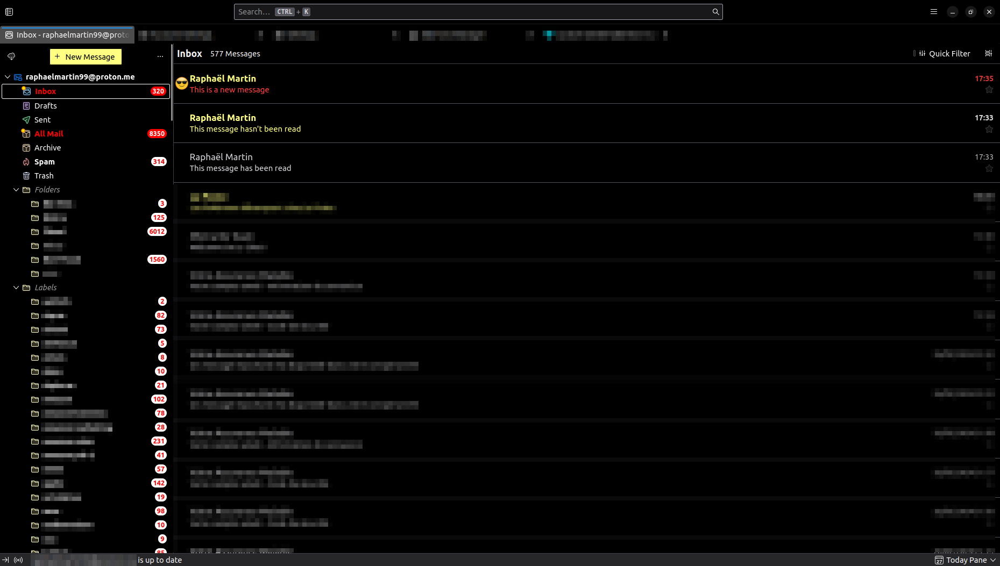

# Dark ThunderBird Theme



## Implementing the CSS Theme in Thunderbird

Thunderbird, a popular email client, allows customization through user-created CSS themes. Follow these steps to apply a custom CSS theme to Thunderbird.

### Step 1: Locate Your Thunderbird Profile Folder

1. Open Thunderbird.
2. Go to `Help` > `Troubleshooting Information` or type `about:support` in the address bar.
3. Under the `Application Basics` section, find the `Profile Folder`.
4. Click on `Open Folder` to open your profile directory.

### Step 2: Create a Chrome Directory

1. In your profile folder, create a new folder named `chrome` if it doesn't already exist.

### Step 3: Create the User CSS File

1. Inside the `chrome` folder, create a new file named `userChrome.css`.
2. This CSS file will contain your custom styles. Open it with a text editor.

### Step 4: Write or Paste Your CSS Code

1. Copy this CSS code:

    ```css
    .thread-card-container {
    margin-left: 1.2rem;
    }

    #threadTree [data-properties~="new"]:not(.selected) .thread-card-container :is(.subject, .date) {
        color: rgb(255, 64, 64) !important;
    }

    tr[data-properties~="new"] .thread-card-container::after {
        content: url(https://raw.githubusercontent.com/kitsuiwebster/portfolio/master/public/favicon24.ico) !important;
        margin-top: 1.45rem;  
    }

    td,
    .container {
        cursor: pointer !important;
    }

    #folderPane,
    td,
    .thread-card-container,
    #unifiedToolbarContent,
    #unifiedToolbarContainer,
    .titlebar-button,
    #tabs-toolbar,
    #tabmail-tabs,
    #folderPaneHeaderBar,
    #threadPaneHeaderBar {
        background-color: black !important;
    }

    element {
        height: 3rem !important;
    }

    .sender {
        font-size: 17px;
    }

    .subject {
        font-size: 15px !important;
        font-weight: 400 !important;
    }

    .thread-card-container {
        gap: 0 !important;
    }

    #threadTree [data-properties~="unread"] .thread-card-container :is(.sender, .subject) {
        color: rgb(255, 255, 130) !important;
    }

    #folderPaneWriteMessage {
        background-color: rgb(255, 255, 130) !important;
    }

    .button.button-primary {
        color: black !important;
        border-color: black !important;
    }

    li.selected > .container {
        background-color: black !important;
        border: 1px solid white;
        border-radius: 5px;
    }

    #folderTree:focus-within li.selected > .container {
        color: white;
    }
    #folderTree li.drop-target > .container,
    #folderTree:focus-within li.selected.new-messages > .container > .name,
    #folderTree:focus-within li.selected > .container > .unread-count,
    .new-messages > .container > .name,
    .unread > .container > .unread-count {
        color: red !important;
    }

    .unread > .container > .unread-count {
        background-color: white !important;
    }

    .new-messages > .container > .unread-count {
        color: white !important;
        background-color: red !important;
    }

    #folderTree:focus-within li.selected > .container > .unread-count {
        color: black !important;
    }

    @media (-moz-overlay-scrollbars) {
        .thread-card-container {
            height: 5rem !important;
        }
    }
    ```

2. Open `userChrome.css` and paste it inside it.

### Step 5: Enable User Styles

Thunderbird disables custom user styles by default for performance reasons. You must enable them:

1. Close Thunderbird.
2. Navigate to your profile folder again and open the `prefs.js` file in a text editor.
3. Add the following line at the end of the file:

    ```javascript
    user_pref("toolkit.legacyUserProfileCustomizations.stylesheets", true);
    ```

4. Save and close `prefs.js`.

### Step 6: Restart Thunderbird

1. Open Thunderbird to see the changes. 😎
